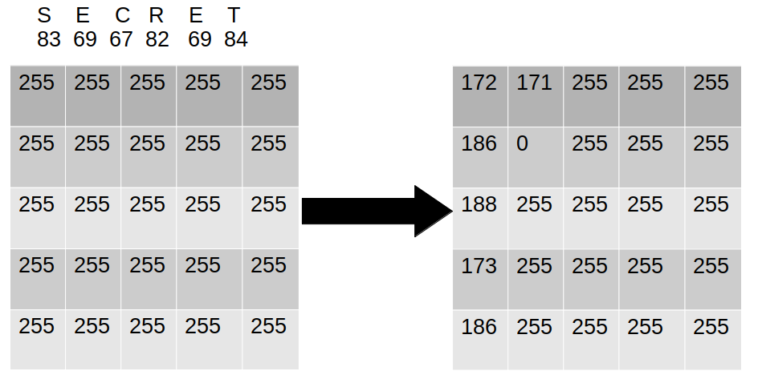

# Image Password Manager - IPWM

A prototype of a password manager that uses images to store user passwords.


To encrypt: ```./ipwm [image_source] [image_dest] [secret] [password]```

To decrypt: ```./ipwm [encrypted_image] [password]```

image_source: The image to store the password in. Must be .png.

image_dest: Path to save the final image to. Must be .png.

encrypted_image: Image path - same as image_dest.

secret: Data string that wants to be hidden. Number of chars must be less than the number of pixels in the image.

password: Password to encrypt the string with.

# Encryption
Data is hidden by first encrypting the data using a viginere cipher, with the key generated from [password].

The image located at [image_source] is read, and all alpha values are set to 255. The ascii value of the first character is subtracted from the alpha value of the first pixel. The next pixel in the image is then selected, and this process is repeated until the end of the secret is reached, where the alpha is set to 0 to denote a null terminator.



# Decryption
The decryption is done in reverse. The pixels in the image are looped through, and their alpha values are subtracted from 255. The loop stops when the null terminator (alpha=0) is reached. This data is then decrypted using the password.

In the current implementation the validity of the password is not tested, and the data is spat out as-is. This makes the current implementation extremely vulnerable as you can retrieve partial secrets.
